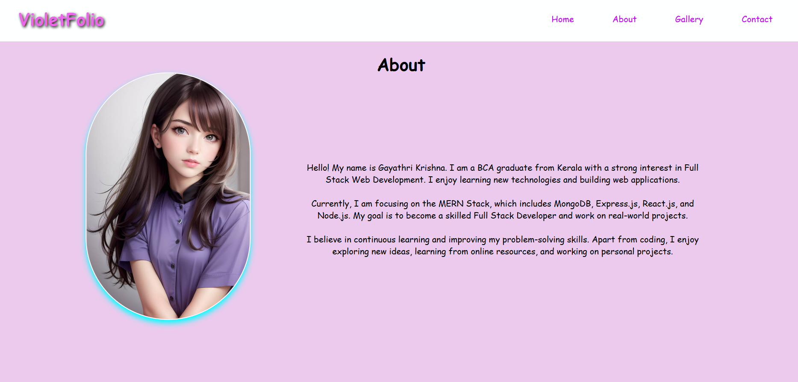
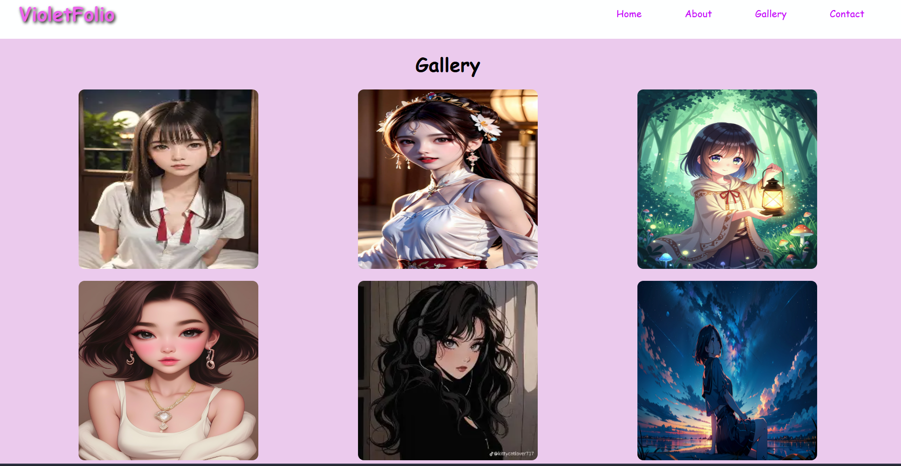
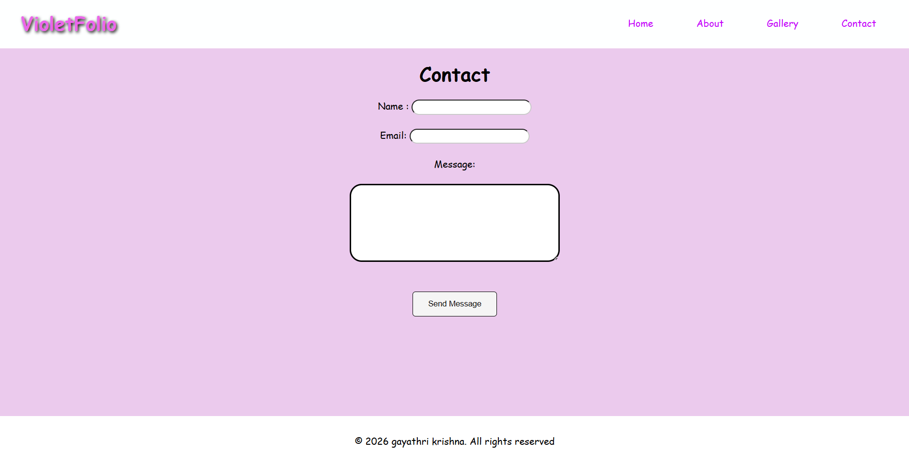

# 💜 VioletFolio — Portfolio-Style Website

<h3 align="center">
  ✨ A Colorful, Responsive Portfolio-Style Frontend Project ✨
</h3>

  
  
  
  
  

---

## 🌸 About The Project

**VioletFolio** is a colorful portfolio-style website created as a **frontend practice project** using **HTML5 and CSS3**.

The project demonstrates how a portfolio-style website can be structured and designed using fundamental frontend development concepts.

It includes:

- 🏠 Home
- 👩‍💻 About
- 🛠️ Skills
- 🖼️ Gallery
- 📩 Contact
- 🦶 Footer

> **Note:** This is a practice and learning project. It is not intended to represent an actual personal professional portfolio.

---

# 🖼️ Project Screenshots

## 🏠 Home Section

  

---

## 👩‍💻 About & Skills Section

  

---

## 🖼️ Gallery Section

  

---

## 📩 Contact Section

  

# ✨ Features

## 🏠 Home Section

The Home section contains:

- Project introduction
- Profile-style image
- Short developer introduction
- Responsive layout
- Decorative text effects
- Navigation links

---

## 👩‍💻 About Section

The About section demonstrates a portfolio-style introduction containing:

- Educational background
- Web development interests
- Full Stack development goals
- Learning interests
- Personal introduction content

---

## 🛠️ Skills Section

The project displays technical skills using a responsive CSS Grid layout.

### Skills Included

- HTML
- CSS
- JavaScript
- Node.js
- Express.js
- MongoDB
- Python
- jQuery
- Bootstrap
- React.js
- Java
- Android

---

## 🖼️ Gallery Section

The Gallery section displays multiple images using **CSS Grid**.

Features include:

- Multiple images
- Responsive grid layout
- Rounded corners
- Hover effects
- Image shadows
- Smooth transitions
- "Show More" functionality
- HTML `
` and `
`

---

## 📩 Contact Section

The project includes a simple frontend contact form containing:

- Name
- Email
- Message
- Send Message button

> The contact form is currently a frontend UI demonstration and does not include backend or email functionality.

---

# 🎨 Design

VioletFolio uses a colorful **purple and violet theme**.

### Main Visual Elements

💜 Violet accents  
🟣 Purple highlights  
🌸 Lavender background  
⚪ White header and footer  
✨ Glow effects  
🖼️ Rounded images  
🎨 Hover animations  

The design focuses on practicing CSS styling while maintaining a simple and attractive interface.

---

# 📱 Responsive Design

The website is designed to adapt to different screen sizes using CSS media queries.

## 🖥️ Desktop

The desktop layout includes:

- Horizontal navigation
- Large profile section
- Multi-column skills layout
- Three-column image gallery
- Centered contact form
